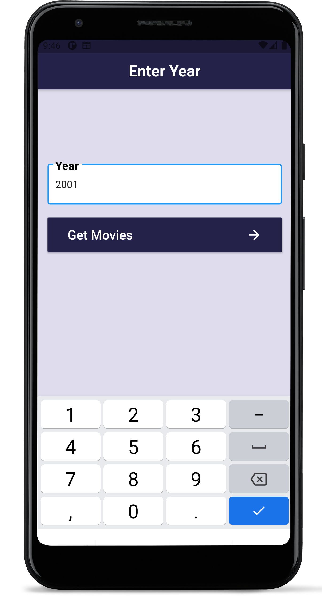
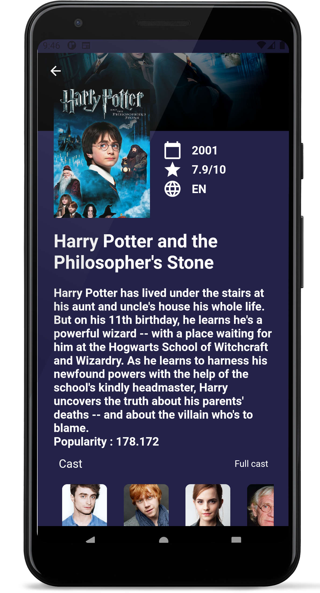
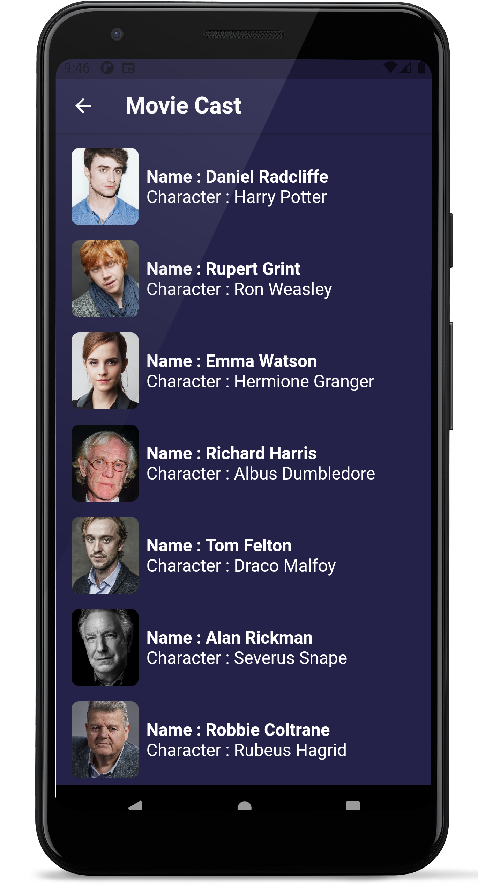

# movieapp

A flutter based app that displays the top 20 movies and their details sorted by popularity for the provided year.

## Feautures

* Users can discover the top movies for a given year
* Neat UI design
* Users can click on a movie for more details
* Users can view the full cast

## Screenshots (Android)
  
  

## To run this app
* Obtain api key from <a href ="https://www.themoviedb.org/">TMDB</a>.
* Replace YOUR_API_KEY in api_constants.dart with your api key.
* Run the app with <b>flutter run</b>

